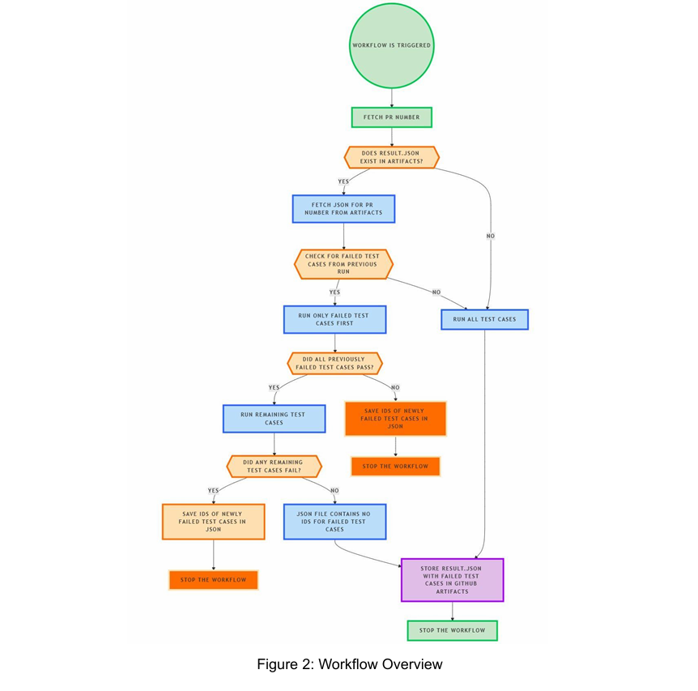
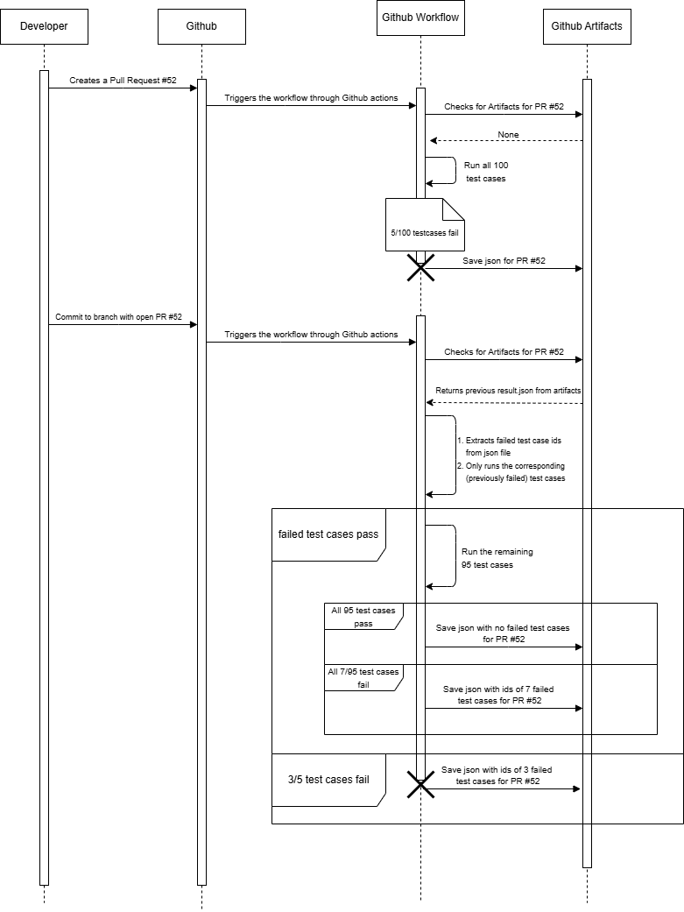

# 🔍 PrioTestCI: Efficient Test Case Prioritization in GitHub Workflows for CI Optimization

This tool enhances your CI efficiency by prioritizing previously failed test cases using GitHub Actions. It speeds up feedback loops, reduces redundant test runs, and saves compute resources—especially useful for repositories with extensive test suites.
## 🧭 Workflow Overview



## 📊 GitHub Action Sequence Diagram


## 🚀 What It Does
- Runs only the failed tests from the previous workflow run.
- If they pass, runs the remaining test cases.
- Stores and retrieves test results using GitHub Artifacts.
- Supports PR-specific scoping and matrix configurations.

## 🛠️ How It Works
The tool uses a history-based test prioritization strategy:

### 🔄 First-Time Pull Request Execution
- When a PR is created for the first time, the workflow runs **all test cases**.
- The results—including failed and passed tests—are stored as a JSON artifact named `pr-<PR_ID>-test-results`.

### 🔁 Consecutive Runs on Same PR
- On subsequent pushes to the same PR:
  - GitHub Actions checks for the previous test result artifact.
  - If found, it extracts only the **previously failed tests**.
  - These are re-executed first.
  - If **all failed tests pass**, the remaining test cases are executed.
  - If **any test fails again**, the workflow exits early, saving time and compute.


### 📦 Artifact Scoping
- Artifacts are scoped per PR using the path `artifacts/pr-<PR_ID>/`.
- For matrix configurations, the path becomes `artifacts/pr-<PR_ID>/<WORKFLOW_ID>/`.
- This ensures correct separation of test results by environment and PR.

> ℹ️ Note: This repository demonstrates a single-job implementation.  
> For a matrix setup (e.g., OS × Python version), refer to the [Pytest fork implementation](https://github.com/ShubhamDesai/pytest/blob/main/.github/workflows/test.yml).  
> In matrix jobs with many test cases, passing long lists of test names as command-line arguments can trigger the "argument list too long" error. To avoid this, we divide the tests into batches and run them in groups. See the batching script [here](https://github.com/ShubhamDesai/pytest/blob/main/scripts/generate_pytest_commands.py).


## 📁 Repo Structure
```
├── .github/workflows/
│   └── windows-tests.yml
├── artifacts/
│   └── pr-1234/
│       └── test_results.json
├── images/
│   └── execution_time_chart.png
└── README.md
```

## 📈 Results and Effectiveness

We evaluated the impact of our test prioritization strategy on the [Pytest repository](https://github.com/pytest-dev/pytest), using a matrix of OS and Python versions.

- 🔗 [Original Workflow Runtime (pytest-dev)](https://github.com/pytest-dev/pytest/actions/runs/14505272745/usage)  
- 🔗 [Optimized Workflow Runtime (our fork)](https://github.com/ShubhamDesai/pytest/actions/runs/16036884229/usage?pr=16)  

> ⚠️ *Note:* The `macos-py39` configuration was excluded. We also ignored workflows that do not run test cases.

### 🔬 Summary

- ✅ **18 out of 19** test configurations showed improvement (one was outlier)
- 🔄 **Average Time Saved:** **81.55%**  
- 📉 **Max Time Saved:** **91.94%** (`ubuntu-py311`)  
- 📈 **Min Time Saved:** **63.75%** (`windows-py39-xdist`)  
- 🕒 **Total Time Reduced:** **2h 23m 29s → 25m 50s**  
- ⚠️ **Outlier:** `ubuntu-py39-freeze` had a negligible 2-second increase  

### 📊 Full Results Table

| Configuration                   | Original   | Forked (Ours) | Time Saved (%) |
|--------------------------------|------------|---------------|----------------|
| windows-py39-unittestsextras   | 10m 24s    | 1m 50s        | 82.37%         |
| windows-py39-pluggy            | 7m 4s      | 1m 36s        | 77.35%         |
| windows-py39-xdist             | 6m 40s     | 2m 25s        | 63.75%         |
| windows-py310                  | 7m 32s     | 2m 25s        | 67.92%         |
| windows-py311                  | 10m 23s    | 2m 27s        | 76.4%          |
| windows-py312                  | 10m 25s    | 1m 53s        | 81.92%         |
| windows-py313                  | 10m 23s    | 1m 38s        | 84.27%         |
| ubuntu-py39-lsof-numpy-pexpect | 10m 32s    | 1m 4s         | 89.87%         |
| ubuntu-py39-pluggy             | 5m 41s     | 59s           | 82.69%         |
| ubuntu-py39-freeze             | 46s        | 48s           | –2s (−)        |
| ubuntu-py39-xdist              | 5m 27s     | 48s           | 85.32%         |
| ubuntu-py310-xdist             | 5m 50s     | 50s           | 85.71%         |
| ubuntu-py311                   | 10m 33s    | 51s           | 91.94%         |
| ubuntu-py312                   | 9m 44s     | 1m 4s         | 89.04%         |
| ubuntu-py313-pexpect           | 10m 31s    | 1m 2s         | 90.17%         |
| ubuntu-pypy3-xdist             | 8m 15s     | 1m 20s        | 83.83%         |
| macos-py310                    | 5m 27s     | 1m 3s         | 80.73%         |
| macos-py312                    | 3m 47s     | 52s           | 77.09%         |
| macos-py313                    | 4m 5s      | 55s           | 77.55%         |

**Total Time:** **2h 23m 29s → 25m 50s**  
**⏱️ Time Saved:** **1h 57m 39s (avg. 81.55%)**


## 📚 References

- **Base Repository**: [CI-Optimization](https://github.com/ShubhamDesai/CI-Optimization)
- **Original Pytest Repo Workflow**: [pytest-dev/pytest](https://github.com/pytest-dev/pytest/blob/main/.github/workflows/test.yml)
- **Forked Pytest Repo with Implementation**: [ShubhamDesai/pytest](https://github.com/ShubhamDesai/pytest/blob/main/.github/workflows/test.yml)
- **Batch Creation Python Script**: [generate_pytest_commands.py](https://github.com/ShubhamDesai/pytest/blob/main/scripts/generate_pytest_commands.py)
- **Original PR on Pytest**: [PR #13380](https://github.com/pytest-dev/pytest/pull/13380)
- **Replicated PR for Testing on Fork**: [PR #16](https://github.com/ShubhamDesai/pytest/pull/16)
- **GRASS GIS Example with Commits**: [GRASS PR #4292](https://github.com/OSGeo/grass/pull/4292/commits)
