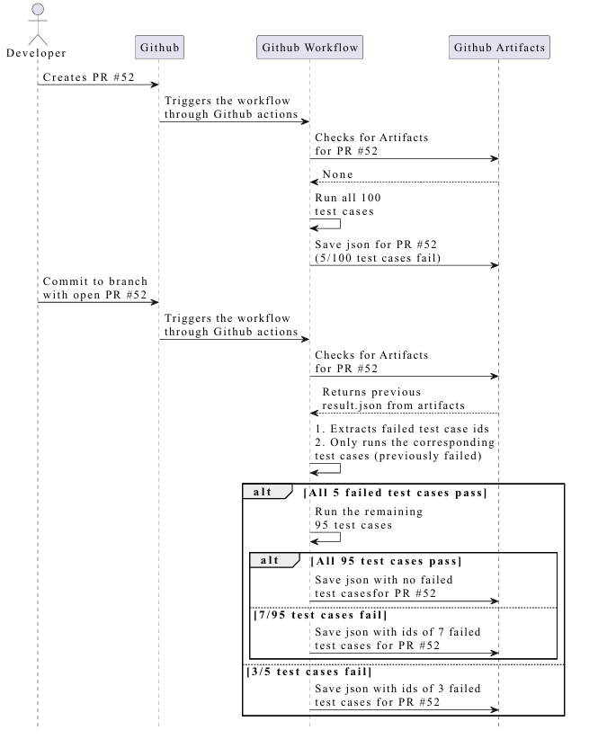

# 🔍 PrioTestCI: Efficient Test Case Prioritization in GitHub Workflows for CI Optimization

This tool enhances your CI efficiency by prioritizing previously failed test cases using GitHub Actions. It speeds up feedback loops, reduces redundant test runs, and saves compute resources—especially useful for repositories with extensive test suites.

## 🚀 What It Does
- Runs only the failed tests from the previous workflow run.
- If they pass, runs the remaining test cases.
- Stores and retrieves test results using GitHub Artifacts.
- Supports PR-specific scoping and matrix configurations.

## 🧭 Workflow Overview
The diagram below shows how PrioTestCI integrates with a GitHub Actions workflow. It starts by executing all tests on the first commit. Failed tests are stored as artifacts. On subsequent commits, only those failed tests are run first. If they pass, remaining tests run; otherwise, the workflow stops early.


## 📊 GitHub Action Sequence Diagram
The following UML sequence diagram shows how PrioTestCI handles test execution in GitHub Actions. It captures two key scenarios: (1) initial test execution when no prior artifacts are found, and (2) subsequent runs where only previously failed test cases are prioritized, followed by conditional execution of the remaining ones. Artifact-based tracking ensures that test failures are efficiently managed across PR commits.



## 🛠️ How It Works
The tool uses a history-based test prioritization strategy:

### 🔄 First-Time Pull Request Execution
- When a PR is created for the first time, the workflow runs **all test cases**.
- The results—including failed and passed tests—are stored as a JSON artifact named `pr-<PR_ID>-test-results`.

### 🔁 Consecutive Runs on Same PR
- On subsequent pushes to the same PR:
  - GitHub Actions checks for the previous test result artifact.
  - If found, it extracts only the **previously failed tests**.
  - These are re-executed first.
  - If **all failed tests pass**, the remaining test cases are executed.
  - If **any test fails again**, the workflow exits early, saving time and compute.


### 📦 Artifact Scoping
- Artifacts are scoped per PR using the path `artifacts/pr-<PR_ID>/`.
- For matrix configurations, the path becomes `artifacts/pr-<PR_ID>/<WORKFLOW_ID>/`.
- This ensures correct separation of test results by environment and PR.

> ℹ️ Note: This repository demonstrates a single-job implementation.  
> For a matrix setup (e.g., OS × Python version), refer to the [Pytest fork implementation](https://github.com/ShubhamDesai/pytest/blob/main/.github/workflows/test.yml).  
> In matrix jobs with many test cases, passing long lists of test names as command-line arguments can trigger the "argument list too long" error. To avoid this, we divide the tests into batches and run them in groups. See the batching script [here](https://github.com/ShubhamDesai/pytest/blob/main/scripts/generate_pytest_commands.py).


## 📁 Repo Structure
```
├── .github/workflows/
│   └── windows-tests.yml
├── artifacts/
│   └── pr-1234/
│       └── test_results.json
├── images/
│   └── execution_time_chart.png
└── README.md
```

## 📊 Test Case Status Identification

PrioTestCI identifies and categorizes test cases into three main statuses using pytest's JSON output format and collection mechanisms.

### **Failed Tests**
Failed tests are identified by parsing the pytest JSON report output using `jq` to filter tests with `outcome == "failed"`:

cat $PREV_RESULTS | jq -r '.tests | map(select(.outcome == "failed")) | .[].nodeid' > $FAILED_TESTS_FILE


These tests are extracted from previous workflow runs stored as GitHub artifacts and prioritized for re-execution in subsequent commits. The workflow specifically targets tests that previously failed to provide faster feedback on whether recent changes have resolved the issues.

### **Skipped Tests** 
Skipped tests are detected using two complementary approaches:

1. **During Collection**: Using `pytest --collect-only` with filtering to exclude tests marked with "SKIP"
2. **During Execution**: From the JSON report by filtering tests with `outcome == "skipped"`

Collection-based detection
tox -e ${{ matrix.tox_env }} --collect-only -v $(cat $FAILED_TESTS_FILE) | grep "SKIP" | grep "::" > $SKIPPED_TESTS_FILE

Execution-based detection
cat $TEMP_RESULTS | jq -r '.tests | map(select(.outcome == "skipped")) | .[].nodeid' > "skipped_tests_report.txt"


Skipped tests are automatically removed from the failed tests list to avoid unnecessary re-execution attempts. This prevents the workflow from trying to run tests that are intentionally disabled or not applicable to the current environment.

### **Passed Tests**
Passed tests are implicitly identified as all tests that are neither failed nor skipped. The workflow uses set operations to determine the remaining test cases:

All tests collected via pytest
pytest --collect-only --quiet | grep "::" > $ALL_TESTS_FILE

Remaining tests = All tests - Failed tests
grep -v -F -f $FAILED_TESTS_FILE $ALL_TESTS_FILE > $REMAINING_TESTS_FILE


These remaining tests are executed only after previously failed tests pass successfully, implementing the "fail-fast" behavior that saves compute resources and provides quicker feedback.

### **Test Discovery Process**

| Step | Description | Command/Method | Purpose |
|------|-------------|----------------|---------|
| **Collection** | All test cases discovered | `pytest --collect-only --quiet \| grep "::"` | Identify complete test suite |
| **Filtering** | Skip-marked tests excluded | `grep -v "SKIP"` during collection | Remove non-executable tests |
| **Categorization** | Previous results parsed | `jq` filtering on JSON artifacts | Separate failed from passed tests |
| **Prioritization** | Failed tests run first | Conditional execution based on status | Implement fail-fast strategy |
| **Execution** | Remaining tests run conditionally | `grep -v -F -f` set operations | Complete test coverage |

### **Workflow Logic**
The test identification process follows this sequence:

1. **Artifact Retrieval**: Download previous test results from GitHub artifacts using PR-specific naming (`pr-<PR_ID>-test-results`)
2. **Status Parsing**: Extract test outcomes from JSON reports using `jq` queries
3. **Set Operations**: Use Unix tools like `grep` to compute test set differences
4. **Conditional Execution**: Run failed tests first, then remaining tests only if no failures occur
5. **Result Storage**: Save new test results as artifacts for future workflow runs

This approach ensures efficient test execution by focusing on previously problematic tests while maintaining comprehensive coverage when all priority tests pass.

## 🏁 Getting Started

To adopt PrioTestCI in your project, follow these steps:

1. **Use the Example Workflow**  
   Start by reviewing the [`windows-tests.yml`](.github/workflows/windows-tests.yml) file in this repository. It provides a minimal setup for test case prioritization using GitHub Actions.

2. **Integrate into Your Workflow**  
   Based on the example, update your own workflow YAML file located under `.github/workflows/` in your repository to match the necessary logic.

3. **For Matrix-Based Workflows**  
   If your project uses matrix configurations (e.g., multiple OS or Python versions), refer to our full implementation in the Pytest fork:  
   🔗 [`test.yml` from Pytest fork](https://github.com/ShubhamDesai/pytest/blob/main/.github/workflows/test.yml)

4. **Enable Test Batching (Optional)**  
   For large test suites, we recommend batching tests to avoid "argument list too long" errors. Use the batching script available here:  
   🔗 [`generate_pytest_commands.py`](https://github.com/ShubhamDesai/pytest/blob/main/scripts/generate_pytest_commands.py)

5. **Run Your First Pull Request**  
   Once integrated, simply open a pull request to the main branch. The GitHub Actions workflow will automatically run with test case prioritization enabled.


## 📈 Results and Effectiveness

We evaluated the impact of our test prioritization strategy on the [Pytest repository](https://github.com/pytest-dev/pytest), using a matrix of OS and Python versions.

- 🔗 [Original Workflow Runtime (pytest-dev)](https://github.com/pytest-dev/pytest/actions/runs/14505272745/usage)  
- 🔗 [Optimized Workflow Runtime (our fork)](https://github.com/ShubhamDesai/pytest/actions/runs/16036884229/usage?pr=16)  

> ⚠️ *Note:* The `macos-py39` configuration was excluded. We also ignored workflows that do not run test cases.

### 🔬 Summary

- ✅ **18 out of 19** test configurations showed improvement (one was outlier)
- 🔄 **Average Time Saved:** **81.55%**  
- 📉 **Max Time Saved:** **91.94%** (`ubuntu-py311`)  
- 📈 **Min Time Saved:** **63.75%** (`windows-py39-xdist`)  
- 🕒 **Total Time Reduced:** **2h 23m 29s → 25m 50s**  
- ⚠️ **Outlier:** `ubuntu-py39-freeze` had a negligible 2-second increase  

### 📊 Full Results Table

| Configuration                   | Original   | Forked (Ours) | Time Saved (%) |
|--------------------------------|------------|---------------|----------------|
| windows-py39-unittestsextras   | 10m 24s    | 1m 50s        | 82.37%         |
| windows-py39-pluggy            | 7m 4s      | 1m 36s        | 77.35%         |
| windows-py39-xdist             | 6m 40s     | 2m 25s        | 63.75%         |
| windows-py310                  | 7m 32s     | 2m 25s        | 67.92%         |
| windows-py311                  | 10m 23s    | 2m 27s        | 76.4%          |
| windows-py312                  | 10m 25s    | 1m 53s        | 81.92%         |
| windows-py313                  | 10m 23s    | 1m 38s        | 84.27%         |
| ubuntu-py39-lsof-numpy-pexpect | 10m 32s    | 1m 4s         | 89.87%         |
| ubuntu-py39-pluggy             | 5m 41s     | 59s           | 82.69%         |
| ubuntu-py39-freeze             | 46s        | 48s           | –2s (−)        |
| ubuntu-py39-xdist              | 5m 27s     | 48s           | 85.32%         |
| ubuntu-py310-xdist             | 5m 50s     | 50s           | 85.71%         |
| ubuntu-py311                   | 10m 33s    | 51s           | 91.94%         |
| ubuntu-py312                   | 9m 44s     | 1m 4s         | 89.04%         |
| ubuntu-py313-pexpect           | 10m 31s    | 1m 2s         | 90.17%         |
| ubuntu-pypy3-xdist             | 8m 15s     | 1m 20s        | 83.83%         |
| macos-py310                    | 5m 27s     | 1m 3s         | 80.73%         |
| macos-py312                    | 3m 47s     | 52s           | 77.09%         |
| macos-py313                    | 4m 5s      | 55s           | 77.55%         |

**Total Time:** **2h 23m 29s → 25m 50s**  
**⏱️ Time Saved:** **1h 57m 39s (avg. 81.55%)**


## 📚 References

- **Base Repository**: [CI-Optimization](https://github.com/ShubhamDesai/CI-Optimization)
- **Original Pytest Repo Workflow**: [pytest-dev/pytest](https://github.com/pytest-dev/pytest/blob/main/.github/workflows/test.yml)
- **Forked Pytest Repo with Implementation**: [ShubhamDesai/pytest](https://github.com/ShubhamDesai/pytest/blob/main/.github/workflows/test.yml)
- **Batch Creation Python Script**: [generate_pytest_commands.py](https://github.com/ShubhamDesai/pytest/blob/main/scripts/generate_pytest_commands.py)
- **Original PR on Pytest**: [PR #13380](https://github.com/pytest-dev/pytest/pull/13380)
- **Replicated PR for Testing on Fork**: [PR #16](https://github.com/ShubhamDesai/pytest/pull/16)
- **GRASS GIS Example with Commits**: [GRASS PR #4292](https://github.com/OSGeo/grass/pull/4292/commits)
- **📽️ Demo Video**: [YouTube – PrioTestCI Walkthrough](https://www.youtube.com/watch?v=_3CF9LJdv0I)

